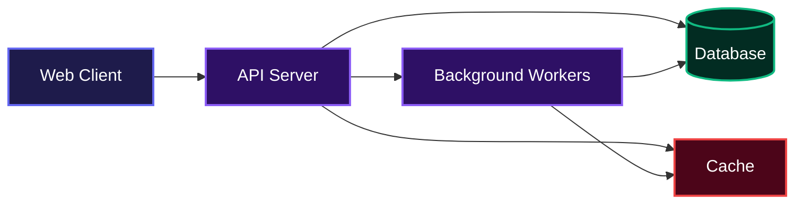
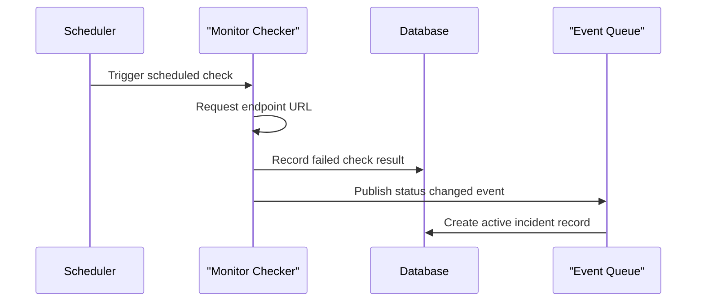
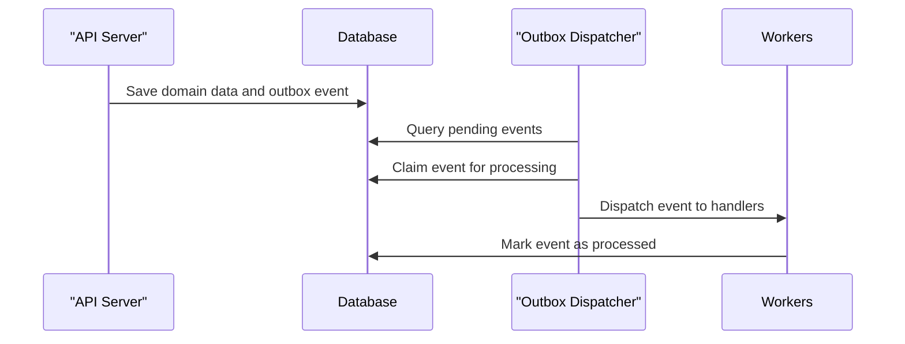

# Operatio

## Overview

Operatio helps development teams track system health and manage incident responses. It continuously monitors project endpoints, creates detailed incident reports during downtime, and generates public status pages to keep users informed. No complicated setup, just straightforward functionality that gives engineering teams the foundational tools they need to stay ahead of system failures.

## System Architecture



## Installation

Follow these steps to set up the project locally on your machine.

1. Clone the repository:
```bash
git clone https://github.com/onosejoor/operatio.git
cd operatio
```

2. Install dependencies:
```bash
pnpm install
```

3. Configure environment variables for the server:
```bash
cd apps/server
cp .env.example .env
```

4. Generate the database client:
```bash
pnpm exec prisma generate
```

5. Start the development server:
```bash
pnpm run start:dev
```

## Usage

Once the server is running, developers can access the API at `http://localhost:3000/api/v1`. The project includes a built in Swagger documentation interface where developers can visually inspect and test the available endpoints.

To interact with the system programmatically, the project provides a comprehensive test script that simulates user registration, monitor creation, and status page configuration. Run the script using the following command:

```bash
pnpm ts-node apps/server/test-api.ts
```

This script will log in, provision new private and public endpoints to monitor, fetch any existing downtime incidents, and output the results directly to the console.

## Features

* **Continuous Uptime Monitoring**: Schedules and executes regular health checks against specified URLs to track response times and HTTP status codes.
* **Automated Incident Management**: Detects when services go down, creates tracked incidents automatically, and marks them as resolved once the endpoint recovers.



* **Status Page Generation**: Aggregates monitor health and incident history into fully customizable public status pages for external communication.
* **Reliable Event Processing**: Leverages an outbox pattern backed by reliable message queues to guarantee all background jobs are processed exactly once.



* **Multi-tenant Organizations**: Allows users to create multiple workspaces, keeping monitors, incidents, and status pages securely isolated between different teams.

## Technologies Used

| Technology | Purpose |
| :--- | :--- |
| TypeScript | Type safe language environment |
| Node.js | Backend JavaScript runtime |
| NestJS | Modular server application framework |
| Prisma | Type safe object relational mapper |
| MongoDB | Primary document database |
| Redis | In memory caching and queue storage |
| BullMQ | Reliable background job processing |
| Argon2 | Secure password hashing |

## Contributing

We welcome contributions from the community. To get started, fork the repository, make your changes on a new feature branch, and submit a pull request. Please ensure you run the testing and linting scripts locally before pushing your code to maintain project quality.

## Author

* LinkedIn: https://linkedin.com/in/devtext16
* X (Twitter): https://x.com/DevText16

<br />

[](https://www.typescriptlang.org/)
[](https://nodejs.org/)
[](https://nestjs.com/)
[](https://www.mongodb.com/)
[](https://redis.io/)

[](https://dokugen.samueltuoyo.com)