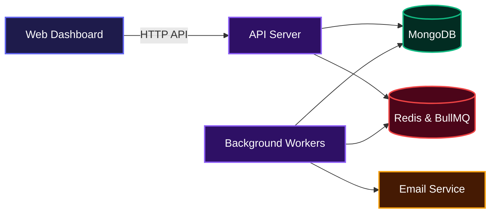
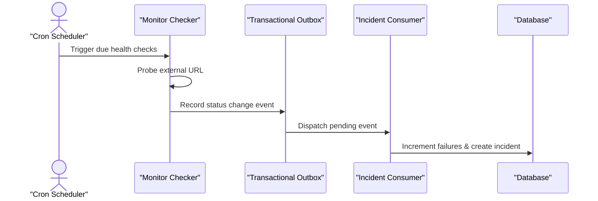
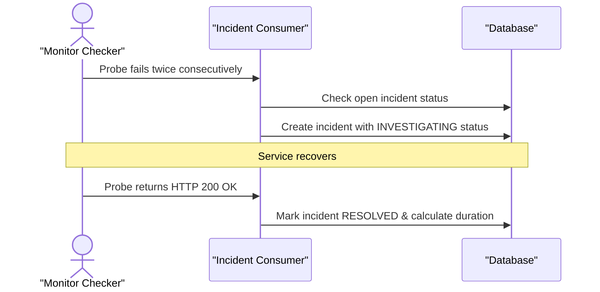

# Operatio

Operatio helps engineering teams track system health, monitor endpoint uptime, and automate incident responses. It checks target services around the clock, detects disruptions using granular assertions, and publishes public status pages so stakeholders stay informed during outages.

## System Architecture


```mermaid
flowchart LR
  Client["Web Dashboard"]
  API["API Server"]
  DB[("MongoDB")]
  Cache[("Redis & BullMQ")]
  Workers["Background Workers"]
  Mail["Email Service"]

  Client -- "HTTP API" --> API
  API --> DB
  API --> Cache
  Workers --> DB
  Workers --> Cache
  Workers --> Mail

  style Client fill:#1e1b4b,stroke:#6366f1,stroke-width:2px,color:#fff
  style API fill:#2e1065,stroke:#8b5cf6,stroke-width:2px,color:#fff
  style DB fill:#022c22,stroke:#10b981,stroke-width:2px,color:#fff
  style Cache fill:#4c0519,stroke:#ef4444,stroke-width:2px,color:#fff
  style Workers fill:#2e1065,stroke:#8b5cf6,stroke-width:2px,color:#fff
  style Mail fill:#451a03,stroke:#f59e0b,stroke-width:2px,color:#fff
```

## Features

- **Automated Health Probes**: Runs scheduled HTTP checks against defined service endpoints and tracks status codes, latency, and response headers.
- **Transactional Outbox Engine**: Reliable background event delivery guarantees that status changes and incidents never get lost during network interruptions.


```mermaid
sequenceDiagram
  actor Scheduler as "Cron Scheduler"
  participant Checker as "Monitor Checker"
  participant Outbox as "Transactional Outbox"
  participant Consumer as "Incident Consumer"
  participant DB as "Database"

  Scheduler->>Checker: Trigger due health checks
  Checker->>Checker: Probe external URL
  Checker->>Outbox: Record status change event
  Outbox->>Consumer: Dispatch pending event
  Consumer->>DB: Increment failures & create incident
```

- **Lifecycle Incident Tracking**: Automates incident declaration when consecutive checks fail, tracks ongoing investigations, and auto-resolves when systems recover.


```mermaid
sequenceDiagram
  actor Checker as "Monitor Checker"
  participant Consumer as "Incident Consumer"
  participant DB as "Database"

  Checker->>Consumer: Probe fails twice consecutively
  Consumer->>DB: Check open incident status
  Consumer->>DB: Create incident with INVESTIGATING status
  Note over Checker,DB: Service recovers
  Checker->>Consumer: Probe returns HTTP 200 OK
  Consumer->>DB: Mark incident RESOLVED & calculate duration
```

- **Session Security with Token Rotation**: Issues HttpOnly cookies with automatic refresh token rotation and argon2 password hashing.
- **Multi-Tenant Workspaces**: Organizes monitors, incident logs, and status pages by team workspace with role-based member boundaries.
- **Public Status Pages**: Displays real-time operational status, aggregate uptime percentages, and scheduled maintenance windows for users.

## Installation

Follow these steps to set up the project locally:

1. Clone the repository:
```bash
git clone https://github.com/onosejoor/operatio.git
cd operatio
```

2. Install workspace dependencies:
```bash
pnpm install
```

3. Set up environment variables inside `apps/server`:
```bash
cp apps/server/.env.example apps/server/.env
```

4. Generate the Prisma client:
```bash
cd apps/server
pnpm exec prisma generate
```

5. Start the API service in development mode:
```bash
pnpm run start:dev
```

## Usage

When the API service starts, it is accessible at `http://localhost:3000/api/v1`. 

Interactive API documentation powered by Scalar is available in your browser at:
```text
http://localhost:3000/api/docs
```

To run the automated end-to-end integration script that tests authentication, monitor creation, and incident flows:
```bash
cd apps/server
pnpm ts-node test-api.ts
```

## Technologies Used

| Technology | Purpose |
| :--- | :--- |
| [TypeScript](https://www.typescriptlang.org/) | Type-safe development across the monorepo |
| [NestJS](https://nestjs.com/) | Modular backend framework and architecture |
| [Prisma](https://www.prisma.io/) | ORM and schema modeling |
| [MongoDB](https://www.mongodb.com/) | Primary document datastore |
| [Redis](https://redis.io/) | Cache layer and message broker |
| [BullMQ](https://bullmq.io/) | Distributed job queues |
| [Argon2](https://github.com/ranisalt/node-argon2) | Password hashing algorithm |
| [Scalar](https://scalar.com/) | Interactive OpenAPI documentation UI |

## API Documentation

All requests and responses use JSON formatting. Authenticated endpoints read your access token from the secure `operatio_access_token` cookie.

### Environment Variables

Configure these environment variables in `apps/server/.env` before launching the application:

```text
NODE_ENV=development
PORT=3000
BACKEND_URL=http://localhost:3000
DATABASE_URL=mongodb://localhost:27017/operatio
REDIS_URL=redis://localhost:6379
REDIS_HOST=localhost
REDIS_PORT=6379
REDIS_USERNAME=
REDIS_PASSWORD=
JWT_SECRET=your-secret-key-change-in-production
JWT_ACCESS_TOKEN_EXPIRES_IN=15m
JWT_REFRESH_TOKEN_EXPIRES_IN=7d
CORS_ORIGIN=http://localhost:3000
FRONTEND_URL=http://localhost:3000
SEND_LIB_API_KEY=your-sendlib-api-key
SEND_LIB_FROM="Operatio <yourproduct@gmail.com>"
```

### Health Endpoints

#### [GET] /api/v1/health
**Description**: Runs diagnostics against MongoDB, Redis, and BullMQ queues to verify connectivity.

**Request**:
No body required.

**Response**:
```json
{
  "status": "healthy",
  "timestamp": "2024-01-01T12:00:00.000Z",
  "checks": {
    "database": { "status": "up" },
    "redis": { "status": "up" },
    "queues": { "status": "up" }
  }
}
```

**Errors**:
- 503: One or more infrastructure subsystems failed their health probe

---

### Authentication Endpoints

#### [POST] /api/v1/auth/register
**Description**: Creates a user account, initializes their default workspace, and dispatches a verification email.

**Request**:
```json
{
  "name": "Jane Doe",
  "email": "jane@example.com",
  "password": "SecurePassword123!"
}
```

**Response**:
```json
{
  "status": "success",
  "message": "Registration successful. Please check your email to verify your account.",
  "data": {
    "message": "User created successfully"
  }
}
```

**Errors**:
- 400: Validation error on input fields
- 409: A user with this email address already exists

#### [POST] /api/v1/auth/verify-email
**Description**: Verifies a user email using their verification token and establishes a session.

**Request**:
```json
{
  "token": "4a7f29b8c0e2a875d9e1f5c6b4a2e1d0"
}
```

**Response**:
```json
{
  "status": "success",
  "message": "Email verified successfully"
}
```

**Errors**:
- 400: Invalid or expired verification token

#### [POST] /api/v1/auth/resend-verification
**Description**: Re-sends a verification email if the user exists and has not yet verified.

**Request**:
```json
{
  "email": "jane@example.com"
}
```

**Response**:
```json
{
  "status": "success",
  "message": "If the account exists, a verification email has been sent"
}
```

#### [POST] /api/v1/auth/login
**Description**: Verifies user credentials and sets HttpOnly cookies containing authentication tokens.

**Request**:
```json
{
  "email": "jane@example.com",
  "password": "SecurePassword123!"
}
```

**Response**:
```json
{
  "status": "success",
  "message": "Login successful"
}
```

**Errors**:
- 401: Invalid credentials
- 403: Email address is not verified

#### [POST] /api/v1/auth/refresh
**Description**: Rotates access and refresh tokens using the refresh cookie.

**Request**:
No body required. Requires `operatio_refresh_token` cookie.

**Response**:
```json
{
  "status": "success",
  "message": "Tokens refreshed successfully"
}
```

**Errors**:
- 401: Missing, expired, or revoked refresh token

#### [POST] /api/v1/auth/logout
**Description**: Revokes the active refresh token and clears session cookies.

**Request**:
No body required.

**Response**:
```json
{
  "status": "success",
  "message": "Logout successful"
}
```

#### [GET] /api/v1/auth/me
**Description**: Retrieves the active user profile and organization memberships.

**Request**:
No body required. Requires authentication cookie.

**Response**:
```json
{
  "status": "success",
  "data": {
    "name": "Jane Doe",
    "email": "jane@example.com",
    "emailVerified": true,
    "memberships": [
      {
        "id": "66f123456789012345678901",
        "role": "OWNER",
        "createdAt": "2024-01-01T12:00:00.000Z",
        "organization": {
          "id": "66f123456789012345678902",
          "name": "Acme Corp"
        }
      }
    ]
  }
}
```

**Errors**:
- 401: Missing or invalid access token

#### [PATCH] /api/v1/auth/me
**Description**: Updates the authenticated user's name.

**Request**:
```json
{
  "name": "Jane Smith"
}
```

**Response**:
```json
{
  "status": "success",
  "message": "Profile updated successfully",
  "data": {
    "name": "Jane Smith",
    "email": "jane@example.com",
    "emailVerified": true
  }
}
```

---

### Organization Endpoints

#### [GET] /api/v1/organizations
**Description**: Lists all organizations where the user is an active member.

**Request**:
No body required. Requires authentication cookie.

**Response**:
```json
{
  "status": "success",
  "data": [
    {
      "id": "66f123456789012345678902",
      "name": "Acme Corp",
      "slug": "acme-corp"
    }
  ]
}
```

#### [GET] /api/v1/organizations/:id
**Description**: Returns specific organization details.

**Request**:
No body required. Requires authentication cookie.

**Response**:
```json
{
  "status": "success",
  "data": {
    "id": "66f123456789012345678902",
    "name": "Acme Corp",
    "slug": "acme-corp"
  }
}
```

**Errors**:
- 403: User is not a member of the organization
- 404: Organization not found

#### [PATCH] /api/v1/organizations/:id
**Description**: Updates workspace settings. Available to workspace owners only.

**Request**:
```json
{
  "name": "Acme Global"
}
```

**Response**:
```json
{
  "status": "success",
  "message": "Workspace updated successfully",
  "data": {
    "id": "66f123456789012345678902",
    "name": "Acme Global",
    "slug": "acme-global"
  }
}
```

**Errors**:
- 403: User is not an owner of the organization

---

### Monitor Endpoints

#### [POST] /api/v1/organizations/:organizationId/monitors
**Description**: Creates a new uptime monitor for a URL endpoint.

**Request**:
```json
{
  "name": "Production API",
  "url": "https://api.example.com/health",
  "interval": 60,
  "timeout": 10000,
  "isPublic": true
}
```

**Response**:
```json
{
  "status": "success",
  "message": "Monitor created successfully",
  "data": {
    "id": "66f123456789012345678903"
  }
}
```

**Errors**:
- 400: Invalid check interval or target URL format
- 409: A monitor with this URL already exists in the organization

#### [GET] /api/v1/organizations/:organizationId/monitors
**Description**: Lists all active and inactive monitors inside an organization.

**Request**:
No body required. Requires authentication cookie.

**Response**:
```json
{
  "status": "success",
  "data": [
    {
      "id": "66f123456789012345678903",
      "name": "Production API",
      "url": "https://api.example.com/health",
      "interval": 60,
      "timeout": 10000,
      "status": "UP",
      "isActive": true,
      "isPublic": true,
      "lastCheckedAt": "2024-01-01T12:00:00.000Z",
      "lastStatusCode": 200,
      "lastResponseTimeMs": 145,
      "nextCheckAt": "2024-01-01T12:01:00.000Z"
    }
  ]
}
```

#### [GET] /api/v1/organizations/:organizationId/monitors/:monitorId
**Description**: Retrieves single monitor configuration and latest probe status.

**Request**:
No body required. Requires authentication cookie.

**Response**:
```json
{
  "status": "success",
  "data": {
    "id": "66f123456789012345678903",
    "name": "Production API",
    "url": "https://api.example.com/health",
    "interval": 60,
    "timeout": 10000,
    "status": "UP",
    "isActive": true,
    "isPublic": true,
    "lastCheckedAt": "2024-01-01T12:00:00.000Z",
    "lastStatusCode": 200,
    "lastResponseTimeMs": 145,
    "nextCheckAt": "2024-01-01T12:01:00.000Z"
  }
}
```

#### [PATCH] /api/v1/organizations/:organizationId/monitors/:monitorId
**Description**: Updates check frequency, timeout limits, or visibility settings.

**Request**:
```json
{
  "interval": 120,
  "timeout": 15000,
  "isActive": true
}
```

**Response**:
```json
{
  "status": "success",
  "message": "Monitor updated successfully"
}
```

#### [DELETE] /api/v1/organizations/:organizationId/monitors/:monitorId
**Description**: Disables active monitoring for a specified target.

**Request**:
No body required. Requires authentication cookie.

**Response**:
```json
{
  "status": "success",
  "message": "Monitor disabled successfully"
}
```

#### [GET] /api/v1/organizations/:organizationId/monitors/:monitorId/checks
**Description**: Retrieves pagination-enabled historical health check probe logs.

**Query Parameters**:
- `page` (number, default: 1)
- `limit` (number, default: 50)
- `fromDate` (ISO 8601 string)
- `toDate` (ISO 8601 string)
- `status` (`UP` | `DOWN` | `PENDING`)
- `sort` (`newest` | `oldest` | `slowest`)

**Request**:
No body required.

**Response**:
```json
{
  "status": "success",
  "data": {
    "checks": [
      {
        "id": "66f123456789012345678904",
        "status": "UP",
        "statusCode": 200,
        "responseTimeMs": 145,
        "checkedAt": "2024-01-01T12:00:00.000Z",
        "error": null
      }
    ],
    "meta": {
      "total": 120,
      "page": 1,
      "limit": 50,
      "totalPages": 3
    }
  }
}
```

#### [GET] /api/v1/organizations/:organizationId/monitors/:monitorId/stats
**Description**: Calculates 90-day uptime summaries, average latency, and check counts.

**Request**:
No body required. Requires authentication cookie.

**Response**:
```json
{
  "status": "success",
  "data": {
    "checkSuccessRate": 99.98,
    "averageResponseTime": 145,
    "totalChecks": 1000,
    "successfulChecks": 999,
    "failedChecks": 1,
    "latestStatus": "UP",
    "dailyUptime": [
      {
        "date": "2024-01-01",
        "uptimePercentage": 100,
        "downDurationMinutes": 0,
        "failureCount": 0
      }
    ]
  }
}
```

---

### Incident Endpoints

#### [GET] /api/v1/organizations/:organizationId/monitors/:monitorId/incidents
**Description**: Lists incidents triggered by an individual monitor.

**Request**:
No body required. Query parameters `page` and `limit` are supported.

**Response**:
```json
{
  "status": "success",
  "data": {
    "data": [
      {
        "id": "66f123456789012345678905",
        "monitorId": "66f123456789012345678903",
        "organizationId": "66f123456789012345678902",
        "monitorName": "Production API",
        "publicId": "e304f5ca-598d-4cb0-bc42-1262d10c14b2",
        "title": "Production API monitor is down",
        "status": "resolved",
        "incidentStatus": "RESOLVED",
        "severity": "MAJOR",
        "startedAt": "2024-01-01T12:00:00.000Z",
        "resolvedAt": "2024-01-01T12:05:00.000Z",
        "duration": 300,
        "durationMs": 300000,
        "events": [
          {
            "type": "STATUS_UPDATE",
            "status": "INVESTIGATING",
            "message": "Incident created due to consecutive monitor failures",
            "createdAt": "2024-01-01T12:00:00.000Z"
          }
        ]
      }
    ],
    "meta": {
      "total": 1,
      "page": 1,
      "limit": 50,
      "totalPages": 1
    }
  }
}
```

#### [GET] /api/v1/organizations/:organizationId/incidents
**Description**: Lists all incident records across an entire workspace.

**Request**:
No body required. Query parameters `page` and `limit` are supported.

**Response**:
```json
{
  "status": "success",
  "data": {
    "data": [
      {
        "id": "66f123456789012345678905",
        "monitorId": "66f123456789012345678903",
        "organizationId": "66f123456789012345678902",
        "monitorName": "Production API",
        "publicId": "e304f5ca-598d-4cb0-bc42-1262d10c14b2",
        "status": "active",
        "incidentStatus": "INVESTIGATING",
        "startedAt": "2024-01-01T12:00:00.000Z",
        "events": []
      }
    ],
    "meta": {
      "total": 1,
      "page": 1,
      "limit": 50,
      "totalPages": 1
    }
  }
}
```

#### [GET] /api/v1/organizations/:organizationId/incidents/:incidentId
**Description**: Retrieves single incident details including diagnostic event logs.

**Request**:
No body required. Requires authentication cookie.

**Response**:
```json
{
  "status": "success",
  "data": {
    "id": "66f123456789012345678905",
    "monitorId": "66f123456789012345678903",
    "organizationId": "66f123456789012345678902",
    "monitorName": "Production API",
    "publicId": "e304f5ca-598d-4cb0-bc42-1262d10c14b2",
    "status": "active",
    "incidentStatus": "INVESTIGATING",
    "startedAt": "2024-01-01T12:00:00.000Z",
    "events": []
  }
}
```

---

### Maintenance Window Endpoints

#### [GET] /api/v1/organizations/:organizationId/maintenance-windows
**Description**: Lists all planned maintenance windows scheduled for an organization.

**Request**:
No body required. Requires authentication cookie.

**Response**:
```json
{
  "status": "success",
  "data": [
    {
      "id": "66f123456789012345678906",
      "title": "Primary Database Upgrade",
      "description": "Routine security patching on the central cluster.",
      "startsAt": "2026-10-04T01:00:00.000Z",
      "endsAt": "2026-10-04T02:00:00.000Z",
      "statusPage": {
        "id": "66f123456789012345678907",
        "name": "Acme Status",
        "slug": "acme",
        "isPublic": true
      }
    }
  ]
}
```

#### [POST] /api/v1/organizations/:organizationId/maintenance-windows
**Description**: Schedules a planned downtime window for a status page.

**Request**:
```json
{
  "title": "Database upgrade",
  "description": "Upgrading primary database cluster.",
  "startsAt": "2026-10-04T01:00:00.000Z",
  "endsAt": "2026-10-04T02:00:00.000Z",
  "statusPageId": "66f123456789012345678907"
}
```

**Response**:
```json
{
  "status": "success",
  "message": "Maintenance scheduled successfully"
}
```

**Errors**:
- 400: Maintenance end time is not after the start time
- 404: Status page not found

#### [PATCH] /api/v1/organizations/:organizationId/maintenance-windows/:id
**Description**: Modifies times, descriptions, or status page associations for a maintenance schedule.

**Request**:
```json
{
  "title": "Rescheduled Database Upgrade",
  "endsAt": "2026-10-04T03:00:00.000Z"
}
```

**Response**:
```json
{
  "status": "success",
  "message": "Maintenance updated successfully"
}
```

#### [DELETE] /api/v1/organizations/:organizationId/maintenance-windows/:id
**Description**: Cancels a scheduled maintenance window.

**Request**:
No body required. Requires authentication cookie.

**Response**:
```json
{
  "status": "success",
  "message": "Maintenance cancelled successfully"
}
```

---

### Status Page Endpoints

#### [POST] /api/v1/organizations/:organizationId/status-pages
**Description**: Creates a new customizable status page.

**Request**:
```json
{
  "name": "Acme Status",
  "slug": "acme",
  "isPublic": true,
  "description": "Current operational status of Acme services",
  "logo": "https://example.com/logo.png",
  "brandColor": "#2563eb"
}
```

**Response**:
```json
{
  "status": "success",
  "message": "Status page created successfully",
  "data": "66f123456789012345678907"
}
```

**Errors**:
- 409: Status page slug is already taken

#### [GET] /api/v1/organizations/:organizationId/status-pages
**Description**: Lists all status pages belonging to the organization.

**Request**:
No body required. Requires authentication cookie.

**Response**:
```json
{
  "status": "success",
  "data": [
    {
      "id": "66f123456789012345678907",
      "organizationId": "66f123456789012345678902",
      "name": "Acme Status",
      "slug": "acme",
      "isPublic": true,
      "description": "Current operational status of Acme services",
      "logo": "https://example.com/logo.png",
      "brandColor": "#2563eb"
    }
  ]
}
```

#### [GET] /api/v1/organizations/:organizationId/status-pages/:statusPageId
**Description**: Retrieves single status page metadata.

**Request**:
No body required. Requires authentication cookie.

**Response**:
```json
{
  "status": "success",
  "data": {
    "id": "66f123456789012345678907",
    "name": "Acme Status",
    "slug": "acme",
    "isPublic": true
  }
}
```

#### [PATCH] /api/v1/organizations/:organizationId/status-pages/:statusPageId
**Description**: Updates status page details, design colors, or visibility.

**Request**:
```json
{
  "name": "Acme Systems Status",
  "isPublic": false
}
```

**Response**:
```json
{
  "status": "success",
  "message": "Status page updated successfully",
  "data": "66f123456789012345678907"
}
```

#### [DELETE] /api/v1/organizations/:organizationId/status-pages/:statusPageId
**Description**: Permanently deletes a status page.

**Request**:
No body required. Requires authentication cookie.

**Response**:
```json
{
  "status": "success",
  "message": "Status page deleted successfully"
}
```

#### [POST] /api/v1/organizations/:organizationId/status-pages/:statusPageId/monitors
**Description**: Links an active monitor to appear on the status page.

**Request**:
```json
{
  "monitorId": "66f123456789012345678903",
  "order": 0
}
```

**Response**:
```json
{
  "status": "success",
  "message": "Monitor added to status page"
}
```

**Errors**:
- 409: Monitor is already added to this status page

#### [GET] /api/v1/organizations/:organizationId/status-pages/:statusPageId/monitors
**Description**: Lists all monitors assigned to a status page.

**Request**:
No body required. Requires authentication cookie.

**Response**:
```json
{
  "status": "success",
  "data": [
    {
      "id": "66f123456789012345678908",
      "statusPageId": "66f123456789012345678907",
      "monitorId": "66f123456789012345678903",
      "order": 0,
      "monitor": {
        "id": "66f123456789012345678903",
        "name": "Production API",
        "url": "https://api.example.com/health",
        "status": "UP",
        "isActive": true,
        "isPublic": true
      }
    }
  ]
}
```

#### [DELETE] /api/v1/organizations/:organizationId/status-pages/:statusPageId/monitors/:monitorId
**Description**: Removes a monitor from a status page.

**Request**:
No body required. Requires authentication cookie.

**Response**:
```json
{
  "status": "success",
  "message": "Monitor removed from status page"
}
```

#### [PATCH] /api/v1/organizations/:organizationId/status-pages/:statusPageId/monitors/:monitorId/order
**Description**: Reorders monitor layout positions on the public status page.

**Request**:
```json
{
  "order": 2
}
```

**Response**:
```json
{
  "status": "success",
  "message": "Monitor order updated"
}
```

---

### Public Status Endpoints

#### [GET] /api/v1/public/status/:slug
**Description**: Fetches live operational status, active incidents, and upcoming maintenance without requiring authentication.

**Request**:
No body required.

**Response**:
```json
{
  "status": "success",
  "data": {
    "statusPage": {
      "name": "Acme Status",
      "slug": "acme",
      "description": "Current operational status of Acme services",
      "logo": "https://example.com/logo.png",
      "brandColor": "#2563eb"
    },
    "status": "operational",
    "monitors": [
      {
        "name": "Production API",
        "status": "UP",
        "uptime": 99.98,
        "responseTime": 142,
        "lastStatusCode": 200,
        "dailyUptime": []
      }
    ],
    "incidents": [],
    "maintenanceWindows": [],
    "aggregateUptime": 99.98
  }
}
```

**Errors**:
- 404: Status page not found or is set to private

#### [GET] /api/v1/public/status/:slug/metrics
**Description**: Returns hourly calculated telemetry metrics for a public status page.

**Request**:
No body required.

**Response**:
```json
{
  "status": "success",
  "data": {
    "averageLatency": 142,
    "successRate": 100,
    "activeIncidents": 0,
    "averageIncidentDuration": 300
  }
}
```

## Contributing

Contributions are welcome. Please open an issue or submit a pull request with your suggested improvements. Ensure that all unit and integration tests pass locally before proposing changes:

```bash
cd apps/server
pnpm run test
pnpm run lint
```

## Author

- LinkedIn: https://linkedin.com/in/devtext16
- X (Twitter): https://x.com/DevText16

<br />

[](https://www.typescriptlang.org/)
[](https://nodejs.org/)
[](https://nestjs.com/)
[](https://www.mongodb.com/)
[](https://redis.io/)

[](https://dokugen.samueltuoyo.com)
