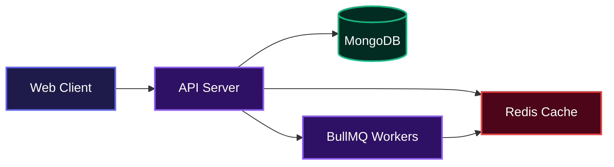
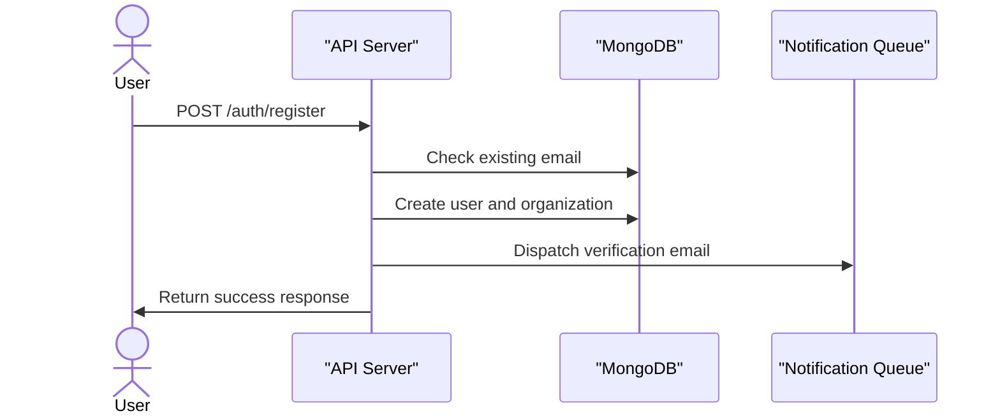
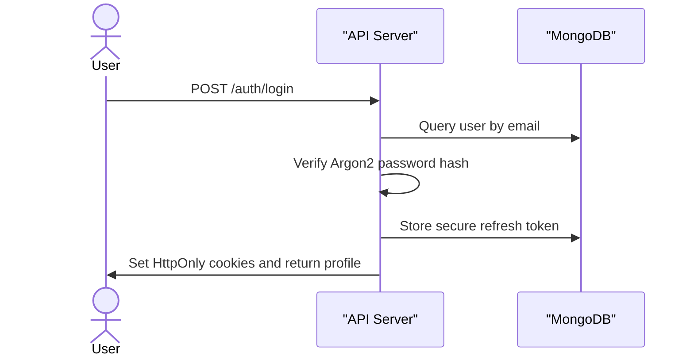

# Upwatch API

## Overview

Upwatch API provides backend services for developer-focused uptime monitoring and incident management. It handles secure user authentication, multi-tenant organization management, and background job processing to ensure reliable monitoring workflows. The platform gives engineering teams the foundational tools they need to track system health and manage incident responses efficiently.

## System Architecture



## Installation

Follow these instructions to set up the project locally.

1. Clone the Repository:
```bash
git clone https://github.com/onosejoor/operatio.git
cd operatio
```

2. Install dependencies:
```bash
pnpm install
```

3. Configure your environment variables:
```bash
cp .env.example .env
```

4. Generate the Prisma client:
```bash
pnpm exec prisma generate
```

5. Start the development server:
```bash
pnpm run start:dev
```

## Usage

Once the server is running, the API will be available at `http://localhost:3000/api/v1`. The project includes an automatic Swagger documentation page where you can interact with the endpoints.

To view the Swagger UI, navigate to the docs endpoint in your browser:

```text
http://localhost:3000/api/docs
```

## Features

* **Secure Authentication**: Implements JWT-based access and refresh token rotation with Argon2 password hashing. Secure HttpOnly cookies manage session state on the client side.
* **Organization Memberships**: Multi-tenant architecture allowing users to own or participate in multiple organizations with specific roles.
* **Background Processing**: Queues heavy tasks, such as email notifications, using BullMQ and Redis to keep API response times low.
* **Health Monitoring**: Built-in diagnostics endpoints to track the connectivity status of the primary database, Redis cache, and background queues.

### Registration and Verification Flow



### Authentication and Session Flow



## API Documentation

The server exposes the following REST endpoints. All requests and responses use JSON formatting.

### Environment Variables

You need to define the following environment variables in your `.env` file for the application to function correctly.

```text
NODE_ENV=development
PORT=3000
DATABASE_URL=mongodb://localhost:27017/upwatch
REDIS_URL=redis://localhost:6379
REDIS_HOST=localhost
REDIS_PORT=6379
REDIS_USERNAME=
REDIS_PASSWORD=
JWT_SECRET=your-secret-key-change-in-production
JWT_ACCESS_TOKEN_EXPIRES_IN=15m
JWT_REFRESH_TOKEN_EXPIRES_IN=7d
CORS_ORIGIN=http://localhost:3000
FRONTEND_URL=http://localhost:3000
EMAIL_HOST=smtp.gmail.com
EMAIL_PORT=587
EMAIL_USER=your-email@gmail.com
EMAIL_PASSWORD=your-app-password
EMAIL_FROM=noreply@upwatch.dev
```

### [GET] /api/v1/health
**Description**: Runs diagnostics on connected services and reports the overall system health.

**Request**:
No body required.

**Response**:
```json
{
  "status": "healthy",
  "timestamp": "2023-10-15T10:00:00.000Z",
  "checks": {
    "database": {
      "status": "up"
    },
    "redis": {
      "status": "up"
    },
    "queues": {
      "status": "up"
    }
  }
}
```

### [POST] /api/v1/auth/register
**Description**: Registers a new user account, creates a personal organization, and sends an email verification link.

**Request**:
```json
{
  "name": "Jane Doe",
  "email": "jane@example.com",
  "password": "SecurePassword123!"
}
```

**Response**:
```json
{
  "status": "success",
  "message": "Registration successful. Please check your email to verify your account.",
  "data": {
    "message": "User created successfully"
  }
}
```

**Errors**:
* 400: Validation error (e.g., weak password)
* 409: User with this email already exists

### [POST] /api/v1/auth/login
**Description**: Authenticates a user and sets HttpOnly cookies containing the access and refresh tokens.

**Request**:
```json
{
  "email": "jane@example.com",
  "password": "SecurePassword123!"
}
```

**Response**:
```json
{
  "status": "success",
  "message": "Login successful",
  "data": {
    "user": {
      "id": "60d5ecb8b392d7001f3e3923",
      "email": "jane@example.com",
      "name": "Jane Doe",
      "emailVerified": true,
      "createdAt": "2023-10-15T10:00:00.000Z"
    },
    "memberships": [
      {
        "id": "60d5ecb8b392d7001f3e3924",
        "role": "OWNER",
        "organization": {
          "id": "60d5ecb8b392d7001f3e3925",
          "name": "Jane Doe",
          "slug": "jane-doe-123"
        }
      }
    ]
  }
}
```

**Errors**:
* 400: Validation error
* 401: Invalid credentials

### [POST] /api/v1/auth/verify-email
**Description**: Verifies a user account using the token sent to their email.

**Request**:
```json
{
  "token": "verification-token-string"
}
```

**Response**:
```json
{
  "status": "success",
  "message": "Email verified successfully"
}
```

**Errors**:
* 400: Invalid or expired verification token

### [POST] /api/v1/auth/refresh
**Description**: Rotates access and refresh tokens using the existing refresh token stored in the `operatio_refresh_token` cookie.

**Request**:
No body required. Requires valid `operatio_refresh_token` cookie.

**Response**:
```json
{
  "status": "success",
  "message": "Tokens refreshed successfully"
}
```

**Errors**:
* 401: Missing, invalid, or expired refresh token

## Technologies Used

| Technology | Purpose |
| ---------- | ------- |
| TypeScript | Language |
| Node.js | Runtime |
| NestJS | Application Framework |
| Prisma | ORM |
| MongoDB | Primary Database |
| Redis | Caching and Queue Store |
| BullMQ | Background Jobs |
| Argon2 | Password Hashing |

## Contributing

We welcome contributions. To get started, fork the repository, make your changes on a feature branch, and submit a pull request. Make sure to run the testing and linting scripts locally before pushing your code.

## Author

* LinkedIn: [https://linkedin.com/in/devtext16](https://linkedin.com/in/devtext16)
* X (Twitter): [https://x.com/DevText16](https://x.com/DevText16)

<br />

[](https://www.typescriptlang.org/)
[](https://nodejs.org/)
[](https://nestjs.com/)
[](https://www.mongodb.com/)
[](https://redis.io/)

[](https://dokugen.samueltuoyo.com)