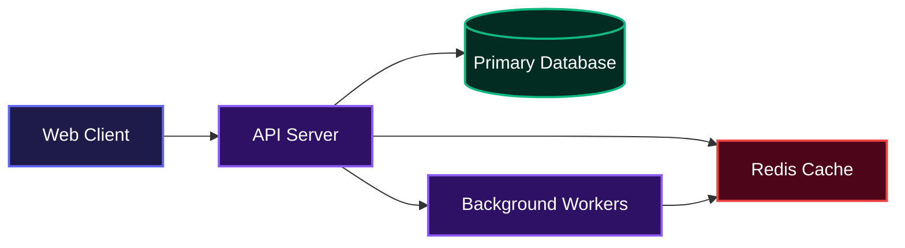
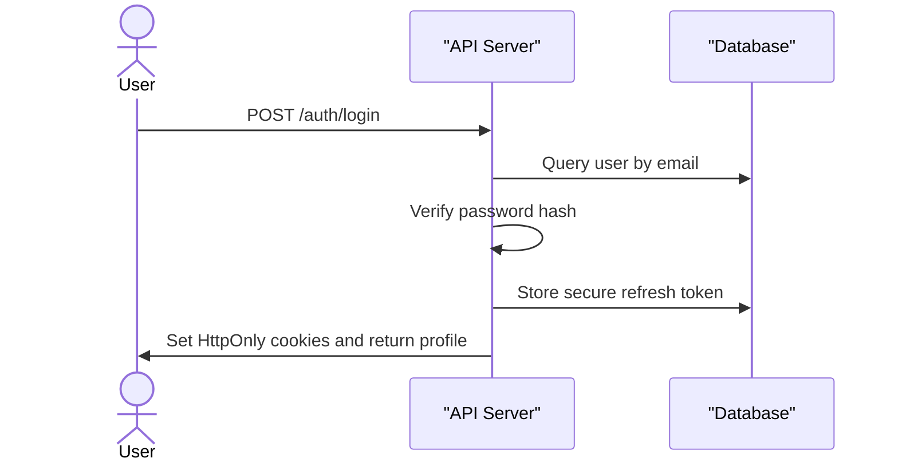
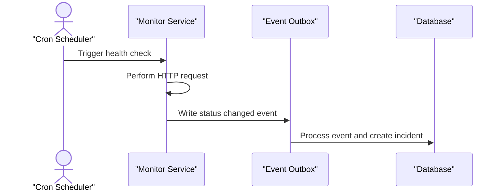

# Operatio API

## Overview

Operatio API helps engineering teams track system health and manage incident responses. It monitors service endpoints automatically, creates incidents when things break, and powers public status pages to keep customers informed. Developers get the foundational tools they need for reliable uptime tracking without complicated configurations.

## System Architecture


```mermaid
flowchart LR
  Client["Web Client"]
  Server["API Server"]
  Database[("Primary Database")]
  Cache["Redis Cache"]
  Workers["Background Workers"]

  Client --> Server
  Server --> Database
  Server --> Cache
  Server --> Workers
  Workers --> Cache

  style Client fill:#1e1b4b,stroke:#6366f1,stroke-width:2px,color:#fff
  style Server fill:#2e1065,stroke:#8b5cf6,stroke-width:2px,color:#fff
  style Database fill:#022c22,stroke:#10b981,stroke-width:2px,color:#fff
  style Cache fill:#4c0519,stroke:#ef4444,stroke-width:2px,color:#fff
  style Workers fill:#2e1065,stroke:#8b5cf6,stroke-width:2px,color:#fff
```

## Installation

Follow these instructions to set up the project locally.

1. Clone the Repository:
```bash
git clone https://github.com/onosejoor/operatio.git
cd operatio
```

2. Install dependencies:
```bash
pnpm install
```

3. Configure your environment variables:
```bash
cp .env.example .env
```

4. Generate the Prisma client:
```bash
pnpm exec prisma generate
```

5. Start the development server:
```bash
pnpm run start:dev
```

## Usage

Once the server is running, the API will be available at `http://localhost:3000/api/v1`. The project includes an automatic Swagger documentation page where you can interact with the endpoints.

To view the Swagger UI, navigate to the docs endpoint in your browser using this URL:
```text
http://localhost:3000/api/docs
```

## Features

* **Secure Authentication**: Manages user sessions via HttpOnly cookies and refresh token rotation.
  

```mermaid
sequenceDiagram
  actor User
  participant API as "API Server"
  participant DB as "Database"

  User->>API: POST /auth/login
  API->>DB: Query user by email
  API->>API: Verify password hash
  API->>DB: Store secure refresh token
  API->>User: Set HttpOnly cookies and return profile
```

* **Automated Incident Management**: Uses an outbox pattern to process monitor checks and trigger incidents automatically when thresholds are met.


```mermaid
sequenceDiagram
  actor Scheduler as "Cron Scheduler"
  participant Checker as "Monitor Service"
  participant Outbox as "Event Outbox"
  participant DB as "Database"

  Scheduler->>Checker: Trigger health check
  Checker->>Checker: Perform HTTP request
  Checker->>Outbox: Write status changed event
  Outbox->>DB: Process event and create incident
```

* **Multi-Tenant Organizations**: Users can own or participate in multiple organizations with specific roles.
* **Custom Status Pages**: Teams can group monitors into public or private status pages to communicate operational health.

## Technologies Used

| Technology | Purpose |
| :--- | :--- |
| TypeScript | Language |
| Node.js | Runtime |
| NestJS | Application Framework |
| Prisma | ORM |
| MongoDB | Primary Database |
| Redis | Caching and Queue Store |
| BullMQ | Background Jobs |
| Argon2 | Password Hashing |

## API Documentation

The server exposes the following REST endpoints. All requests and responses use JSON formatting.

### Environment Variables

You need to define the following environment variables in your `.env` file for the application to function correctly.

```text
NODE_ENV=development
PORT=3000
BACKEND_URL=http://localhost:3000
DATABASE_URL=mongodb://localhost:27017/operatio
REDIS_URL=redis://localhost:6379
REDIS_HOST=localhost
REDIS_PORT=6379
REDIS_USERNAME=
REDIS_PASSWORD=
JWT_SECRET=your-secret-key-change-in-production
JWT_ACCESS_TOKEN_EXPIRES_IN=15m
JWT_REFRESH_TOKEN_EXPIRES_IN=7d
CORS_ORIGIN=http://localhost:3000
FRONTEND_URL=http://localhost:3000
SEND_LIB_API_KEY=your-sendlib-api-key
SEND_LIB_FROM="Operatio <yourproduct@gmail.com>"
```

### Health Endpoints

#### [GET] /api/v1/health
**Description**: Runs diagnostics on connected services and reports the overall system health.

**Request**:
No body required.

**Response**:
```json
{
  "status": "healthy",
  "timestamp": "2024-01-01T12:00:00.000Z",
  "checks": {
    "database": { "status": "up" },
    "redis": { "status": "up" },
    "queues": { "status": "up" }
  }
}
```

### Authentication Endpoints

#### [POST] /api/v1/auth/register
**Description**: Registers a new user account, creates a personal organization, and sends an email verification link.

**Request**:
```json
{
  "name": "Jane Doe",
  "email": "jane@example.com",
  "password": "SecurePassword123!"
}
```

**Response**:
```json
{
  "status": "success",
  "message": "Registration successful. Please check your email to verify your account.",
  "data": {
    "message": "User created successfully"
  }
}
```
**Errors**:
* 400: Validation error
* 409: User with this email already exists

#### [POST] /api/v1/auth/login
**Description**: Authenticates a user and sets HttpOnly cookies containing the access and refresh tokens.

**Request**:
```json
{
  "email": "jane@example.com",
  "password": "SecurePassword123!"
}
```

**Response**:
```json
{
  "status": "success",
  "message": "Login successful",
  "data": {
    "tokens": {
      "accessToken": "ey...",
      "refreshToken": "ey..."
    }
  }
}
```
**Errors**:
* 401: Invalid credentials

#### [POST] /api/v1/auth/verify-email
**Description**: Verifies a user account using the token sent to their email.

**Request**:
```json
{
  "token": "verification-token-string"
}
```

**Response**:
```json
{
  "status": "success",
  "message": "Email verified successfully"
}
```

#### [POST] /api/v1/auth/resend-verification
**Description**: Resends an email verification link to the provided address.

**Request**:
```json
{
  "email": "jane@example.com"
}
```

**Response**:
```json
{
  "status": "success",
  "message": "If the account exists, a verification email has been sent",
  "data": {
    "message": "If the account exists, a verification email has been sent"
  }
}
```

#### [POST] /api/v1/auth/refresh
**Description**: Rotates access and refresh tokens using the existing refresh token stored in the cookie.

**Request**:
No body required. Requires valid `operatio_refresh_token` cookie.

**Response**:
```json
{
  "status": "success",
  "message": "Tokens refreshed successfully"
}
```
**Errors**:
* 401: Missing, invalid, or expired refresh token

#### [POST] /api/v1/auth/logout
**Description**: Ends the current session by revoking the refresh token and clearing cookies.

**Request**:
No body required.

**Response**:
```json
{
  "status": "success",
  "message": "Logout successful"
}
```

#### [GET] /api/v1/auth/me
**Description**: Retrieves the authenticated user identity and organization memberships.

**Request**:
No body required. Requires valid `operatio_access_token` cookie.

**Response**:
```json
{
  "status": "success",
  "data": {
    "name": "Jane Doe",
    "email": "jane@example.com",
    "emailVerified": true,
    "memberships": [
      {
        "id": "mem-id",
        "role": "OWNER",
        "createdAt": "2024-01-01T12:00:00.000Z",
        "organization": {
          "id": "org-id",
          "name": "Jane Doe"
        }
      }
    ]
  }
}
```

### Organization Endpoints

#### [GET] /api/v1/organizations
**Description**: Lists all organizations available to the current user.

**Request**:
No body required. Requires auth cookie.

**Response**:
```json
{
  "status": "success",
  "data": [
    {
      "id": "org-id",
      "name": "Acme Corp",
      "slug": "acme-corp"
    }
  ]
}
```

#### [GET] /api/v1/organizations/:id
**Description**: Gets specific details of an organization the current user belongs to.

**Request**:
No body required. Requires auth cookie.

**Response**:
```json
{
  "status": "success",
  "data": {
    "id": "org-id",
    "name": "Acme Corp",
    "slug": "acme-corp"
  }
}
```

### Monitor Endpoints

#### [POST] /api/v1/organizations/:organizationId/monitors
**Description**: Creates a new uptime monitor in the specified organization.

**Request**:
```json
{
  "name": "Production API",
  "url": "https://api.example.com/health",
  "interval": 60,
  "timeout": 10000,
  "isPublic": true
}
```

**Response**:
```json
{
  "status": "success",
  "message": "Monitor created successfully",
  "data": {
    "id": "monitor-id"
  }
}
```

#### [GET] /api/v1/organizations/:organizationId/monitors
**Description**: Lists all active monitors within an organization.

**Request**:
No body required. Requires auth cookie.

**Response**:
```json
{
  "status": "success",
  "data": [
    {
      "id": "monitor-id",
      "name": "Production API",
      "url": "https://api.example.com/health",
      "interval": 60,
      "timeout": 10000,
      "status": "UP",
      "isActive": true,
      "isPublic": true,
      "lastCheckedAt": "2024-01-01T12:00:00.000Z",
      "lastStatusCode": 200,
      "lastResponseTimeMs": 145,
      "nextCheckAt": "2024-01-01T12:01:00.000Z"
    }
  ]
}
```

#### [GET] /api/v1/organizations/:organizationId/monitors/:monitorId
**Description**: Retrieves a single monitor by its ID.

**Request**:
No body required. Requires auth cookie.

**Response**:
```json
{
  "status": "success",
  "data": {
    "id": "monitor-id",
    "name": "Production API",
    "url": "https://api.example.com/health",
    "interval": 60,
    "timeout": 10000,
    "status": "UP",
    "isActive": true,
    "isPublic": true
  }
}
```

#### [PATCH] /api/v1/organizations/:organizationId/monitors/:monitorId
**Description**: Updates a monitor configuration.

**Request**:
```json
{
  "interval": 120,
  "timeout": 15000,
  "isActive": true
}
```

**Response**:
```json
{
  "status": "success",
  "message": "Monitor updated successfully"
}
```

#### [DELETE] /api/v1/organizations/:organizationId/monitors/:monitorId
**Description**: Disables an organization monitor.

**Request**:
No body required. Requires auth cookie.

**Response**:
```json
{
  "status": "success",
  "message": "Monitor disabled successfully"
}
```

#### [GET] /api/v1/organizations/:organizationId/monitors/:monitorId/checks
**Description**: Retrieves historical network checks for a specific monitor.

**Request**:
No body required. Query parameters `page` and `limit` are supported.

**Response**:
```json
{
  "status": "success",
  "data": {
    "checks": [
      {
        "id": "check-id",
        "status": "UP",
        "statusCode": 200,
        "responseTimeMs": 145,
        "checkedAt": "2024-01-01T12:00:00.000Z",
        "error": null
      }
    ],
    "meta": {
      "total": 1,
      "page": 1,
      "limit": 50,
      "totalPages": 1
    }
  }
}
```

#### [GET] /api/v1/organizations/:organizationId/monitors/:monitorId/stats
**Description**: Retrieves aggregated statistics for a specific monitor.

**Request**:
No body required. Requires auth cookie.

**Response**:
```json
{
  "status": "success",
  "data": {
    "checkSuccessRate": 99.98,
    "averageResponseTime": 145,
    "totalChecks": 1000,
    "successfulChecks": 999,
    "failedChecks": 1,
    "latestStatus": "UP"
  }
}
```

### Incident Endpoints

#### [GET] /api/v1/organizations/:organizationId/monitors/:monitorId/incidents
**Description**: Lists all incidents associated with a specific monitor.

**Request**:
No body required. Query parameters `page` and `limit` are supported.

**Response**:
```json
{
  "status": "success",
  "data": {
    "data": [
      {
        "id": "incident-id",
        "monitorId": "monitor-id",
        "organizationId": "org-id",
        "detectedAt": "2024-01-01T12:00:00.000Z",
        "resolvedAt": null
      }
    ],
    "meta": {
      "total": 1,
      "page": 1,
      "limit": 50,
      "totalPages": 1
    }
  }
}
```

#### [GET] /api/v1/organizations/:organizationId/incidents
**Description**: Lists all incidents across an entire organization.

**Request**:
No body required. Query parameters `page` and `limit` are supported.

**Response**:
```json
{
  "status": "success",
  "data": {
    "data": [
      {
        "id": "incident-id",
        "monitorId": "monitor-id",
        "organizationId": "org-id",
        "detectedAt": "2024-01-01T12:00:00.000Z",
        "resolvedAt": null
      }
    ],
    "meta": {
      "total": 1,
      "page": 1,
      "limit": 50,
      "totalPages": 1
    }
  }
}
```

#### [GET] /api/v1/organizations/:organizationId/incidents/:incidentId
**Description**: Gets details of a specific incident.

**Request**:
No body required. Requires auth cookie.

**Response**:
```json
{
  "status": "success",
  "data": {
    "id": "incident-id",
    "monitorId": "monitor-id",
    "organizationId": "org-id",
    "detectedAt": "2024-01-01T12:00:00.000Z",
    "resolvedAt": null
  }
}
```

### Status Page Endpoints

#### [POST] /api/v1/organizations/:organizationId/status-pages
**Description**: Creates a new status page.

**Request**:
```json
{
  "name": "Acme Status",
  "slug": "acme",
  "isPublic": true,
  "description": "Current operational status of Acme services",
  "logo": "https://example.com/logo.png"
}
```

**Response**:
```json
{
  "status": "success",
  "message": "Status page created successfully",
  "data": "status-page-id"
}
```

#### [GET] /api/v1/organizations/:organizationId/status-pages
**Description**: Lists all status pages in an organization.

**Request**:
No body required. Requires auth cookie.

**Response**:
```json
{
  "status": "success",
  "data": [
    {
      "id": "status-page-id",
      "organizationId": "org-id",
      "name": "Acme Status",
      "slug": "acme",
      "isPublic": true,
      "description": "Current operational status of Acme services",
      "logo": "https://example.com/logo.png",
      "createdAt": "2024-01-01T12:00:00.000Z",
      "updatedAt": "2024-01-01T12:00:00.000Z"
    }
  ]
}
```

#### [GET] /api/v1/organizations/:organizationId/status-pages/:statusPageId
**Description**: Retrieves a specific status page by its ID.

**Request**:
No body required. Requires auth cookie.

**Response**:
```json
{
  "status": "success",
  "data": {
    "id": "status-page-id",
    "organizationId": "org-id",
    "name": "Acme Status",
    "slug": "acme",
    "isPublic": true,
    "description": "Current operational status of Acme services",
    "logo": "https://example.com/logo.png"
  }
}
```

#### [PATCH] /api/v1/organizations/:organizationId/status-pages/:statusPageId
**Description**: Updates a status page configuration.

**Request**:
```json
{
  "name": "Updated Acme Status",
  "isPublic": false
}
```

**Response**:
```json
{
  "status": "success",
  "message": "Status page updated successfully",
  "data": "status-page-id"
}
```

#### [DELETE] /api/v1/organizations/:organizationId/status-pages/:statusPageId
**Description**: Deletes a status page.

**Request**:
No body required. Requires auth cookie.

**Response**:
```json
{
  "status": "success",
  "message": "Status page deleted successfully"
}
```

#### [POST] /api/v1/organizations/:organizationId/status-pages/:statusPageId/monitors
**Description**: Adds a specific monitor to a status page.

**Request**:
```json
{
  "monitorId": "monitor-id-123",
  "order": 0
}
```

**Response**:
```json
{
  "status": "success",
  "message": "Monitor added to status page"
}
```

#### [GET] /api/v1/organizations/:organizationId/status-pages/:statusPageId/monitors
**Description**: Retrieves all monitors linked to a status page.

**Request**:
No body required. Requires auth cookie.

**Response**:
```json
{
  "status": "success",
  "data": [
    {
      "id": "link-id",
      "statusPageId": "status-page-id",
      "monitorId": "monitor-id",
      "order": 0,
      "monitor": {
        "id": "monitor-id",
        "name": "API Monitor",
        "url": "https://api.example.com",
        "status": "UP",
        "isActive": true,
        "isPublic": true
      }
    }
  ]
}
```

#### [DELETE] /api/v1/organizations/:organizationId/status-pages/:statusPageId/monitors/:monitorId
**Description**: Removes a monitor from a status page.

**Request**:
No body required. Requires auth cookie.

**Response**:
```json
{
  "status": "success",
  "message": "Monitor removed from status page"
}
```

#### [PATCH] /api/v1/organizations/:organizationId/status-pages/:statusPageId/monitors/:monitorId/order
**Description**: Updates the display order of a monitor on a status page.

**Request**:
```json
{
  "order": 1
}
```

**Response**:
```json
{
  "status": "success",
  "message": "Monitor order updated"
}
```

### Public Status Endpoints

#### [GET] /api/v1/public/status/:slug
**Description**: Retrieves public status page data using its public slug. Does not require authentication.

**Request**:
No body required.

**Response**:
```json
{
  "status": "success",
  "data": {
    "statusPage": {
      "name": "Acme Status",
      "slug": "acme",
      "description": "Current operational status of Acme services",
      "logo": "https://example.com/logo.png"
    },
    "status": "operational",
    "monitors": [
      {
        "name": "API",
        "status": "UP",
        "uptime": 99.98,
        "responseTime": 142,
        "lastStatusCode": 200,
        "dailyUptime": []
      }
    ],
    "incidents": [],
    "aggregateUptime": 99.5
  }
}
```
**Errors**:
* 404: Status page not found or not public

#### [GET] /api/v1/public/status/:slug/metrics
**Description**: Retrieves calculated metrics for a public status page.

**Request**:
No body required.

**Response**:
```json
{
  "status": "success",
  "data": {
    "averageLatency": 150,
    "successRate": 99.5,
    "activeIncidents": 0,
    "averageIncidentDuration": 3600
  }
}
```

## Contributing

We welcome contributions. To get started, fork the repository, make your changes on a feature branch, and submit a pull request. Make sure to run the testing and linting scripts locally before pushing your code.

## Author

* LinkedIn: https://linkedin.com/in/devtext16
* X (Twitter): https://x.com/DevText16

<br />

[](https://www.typescriptlang.org/)
[](https://nodejs.org/)
[](https://nestjs.com/)
[](https://www.mongodb.com/)
[](https://redis.io/)

[](https://dokugen.samueltuoyo.com)
